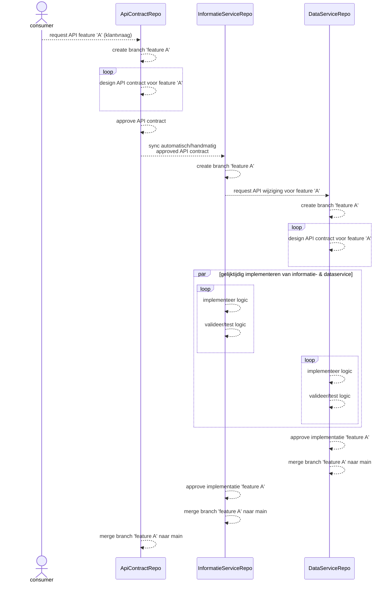

# ADR 0002: Schema-First API Design

## Status
Voorstel

## Context
De functionaliteiten van de BRP API wordt samengesteld uit de functionaliteiten van meerdere microservices.
Wanneer bijvoorbeeld de gezagsrelaties van een persoon wordt gevraagd, dan wordt de gezagsrelaties bepaald door de Gezag service en worden de personen in de gezagsrelaties door de Personen Informatie service verrijkt met hun volledige naam.
En wanneer bijvoorbeeld de bewoning van een adresseerbaar object wordt gevraagd, dan wordt de bewoning bepaald door de Bewoning Data service en worden de bewoners in een bewoning periode verrijkt met hun volledige naam door de Bewoning Informatie service.
Voor een goede developer experience is het noodzakelijk dat voor een gegeven zoals de burgerservicenummer of de volledige naam van een persoon altijd dezelfde benaming en typering wordt gehanteerd.
Andere voorbeelden van goede developer experience is dat fouten bij het vragen van gezagsrelaties of bewoningen met dezelfde structuur worden gemeld en dat voor het contract van een functionaliteit dezelfde stijl wordt gehanteerd als het contract van een andere functionaliteit.
Om dit te kunnen realiseren, moet een werkwijze worden gekozen die dit faciliteert.

## Beslissing
We hebben besloten om:
- de [Schema-First API Design][SchemaFirst] werkwijze te hanteren voor het implementeren van functionaliteit bij zowel de BRP API als de APIs van de onderliggende microservices
- het contract van de BRP API en van de APIs van de onderliggende microservices te ontwerpen met behulp van de [OpenAPI Specificatie][OAS]
- parallel tijdens het ontwerpen van het API contract van een functionaliteit, het gewenste gedrag van de functionaliteit te documenteren met behulp van voorbeelden/scenarios geschreven met [Gherkin][Gherkin]

## Consequenties
- **Voordelen:**
    - Een duidelijk en consistent ontworpen API contract en voorbeelden/scenarios die het gedrag van de functionaliteit expliciet beschrijven
    - Verbeterde communicatie tussen de stakeholders.
    - Eerder en gemakkelijker valideren van het API contract.
    - Betere Developer Experience (betere documentatie, client code generatie en consumers en provider van het API contract kunnen parallel worden geïmplementeerd).

- **Nadelen:**
    - Leercurve voor het ontwikkel team, als de team leden niet bekend zijn met Schema-First API design en het beschrijven van requirements met behulp van Gherkin.
    - Er moet tijd worden besteed in het definieren en implementeren van de Gegeven/Als/Dan stappen die worden gebruikt voor het beschrijven van voorbeelden/scenarios met behulp van Gherkin.
    - Het duurt langer voordat een functionaliteit is geïmplementeerd.
    - De code gegenereerd aan de hand van een in OAS gespecificeerd API contract is niet altijd correct, waardoor de gegenereerde code moet worden aangepast.

## Overwogen alternatieven
- **Code-First API Design:** De gewenste wijziging/toevoeging implementeren en vervolgens het API contract genereren vanuit de implementatie.
  Er is niet voor deze aanpak gekozen omdat de kans groot is dat er achteraf wijziging moet worden gedaan in de implementatie om het gewenste API contract te kunnen genereren.
  Als de scenarios voor het beschrijven van de functionaliteit ook achteraf wordt geschreven, dan is de kans heel groot dat er verkeerde aannames worden gemaakt tijdens de implementatie.

## Afspraken

De [brp-shared][BRPShared] repo is opgezet voor het beheren en delen van:
- de herbruikbare component schemas beschreven met behulp van de [OpenAPI Specificatie][OAS]
- de herbruikbare Gegeven/Als/Dan stap definities voor het beschrijven van voorbeelden/scenarios met behulp van Gherkin
- de implementatie (automation) van de herbruikbare Gegeven/Als/Dan stap definities
- verwijzingen naar OpenAPI en Gherkin tooling, zoals OpenAPI linters en resolvers, en de repo-sync github workflow

De schemas, stap definities en bijbehorende automation kunnen as-is worden gebruikt of kunnen dienen als referentie en/of inspiratie
voor het definieren van component schemas en stap definities voor een specifiek domein.

De component schemas zijn te vinden in de volgende sub-mappen van de **specificatie** map:
- **problem-details** map met component schemas conform [RFC9457: Problem Details for HTTP API][RFC9475] voor het leveren van foutmeldingen in een consistent formaat 
- **brp** map met component schemas voor de LO BRP elementen
- **brp-api** map met van de LO BRP afgeleide component schemas, zoals
  - query parameter definities
  - definities van informatie componenten zoals gezagsrelaties en adressering

De [brp-shared][BRPShared] repo wordt hergebruikt door de repo als template te gebruiken bij het opzetten van een nieuwe repo.
De repo-sync github workflow kan daarna worden gebruikt nieuwe toevoegingen en wijzigingen in de [brp-shared][BRPShared] repo over te halen naar de nieuwe repo.
Een bestaande repo kan de [brp-shared][BRPShared] repo hergebruiken door de repo-sync github workflow te copieren naar de betreffende repo.
Een .templatesyncignore bestand moet worden toegevoegd in de .github map. Dit bestand wordt gebruikt om aan te geven met welke mappen/bestanden in sync moeten worden gehouden met de [brp-shared][BRPShared] repo.

- Een publieke API contract (wordt geconsumeerd door applicaties van zowel binnen als buiten de organisatie van de provider) wordt beheerd in een voor die API opgezette GitHub repo. Dit is een publieke repo zodat iedereen toegang heeft tot het API contract. Een voorbeeld van zo'n repo is de [Haal Centraal BRP bevragen][ApiContractRepo] repo.

  De benodigde OAS bestanden van/voor het API contract en het gepubliceerde (in de genereervariant map) OAS bestand van het API contract staan in de **specificatie** map van de repo.

  De repo waar de provider implementatie van het externe API contract wordt beheerd, bevat in zijn **specificatie** map van de **main** branch een kopie van dé versie van het OAS bestand van het externe API contract dat door de provider is geïmplementeerd. Een voorbeeld van zo'n repo is de [personen-informatie-service][InformatieServiceRepo] repo.
- Een intern API contract (kan alleen door applicaties binnen de organisatie van de provider worden geconsumeerd) wordt beheerd in de GitHub repo waar de provider implementatie van het API contract wordt beheerd. Voorbeelden van zo'n repo zijn de [personen-data-service][DataServiceRepo] repo en de [brp-api-gezag][GezagService] repo. De benodigde OAS bestanden van/voor een intern API contract staan ook in de **specificatie** map van de repo.
- Wijzigingen aan een extern API contract worden gedaan in een branch in de repo van het externe API contract. Wanneer de wijzigingen aan het API contract zijn goedgekeurd, dan wordt de nieuwe gepubliceerde versie van het OAS bestand handmatig/automatisch gekopieerd naar de repo van de provider van het API contract. Om de relatie tussen de wijzigingen in de verschillende GitHub repos te kunnen leggen wordt over alle repos dezelfde branchnaam gebruikt.

Onderstaand sequence diagram illustreert de hierboven beschreven afspraken

[OAS]: https://spec.openapis.org/oas/latest.html
[Gherkin]: https://cucumber.io/docs/gherkin/
[SchemaFirst]: https://dzone.com/articles/schema-first-api-design
[RFC9475]: https://www.rfc-editor.org/rfc/rfc9457.html
[ApiContractRepo]: https://github.com/BRP-API/Haal-Centraal-BRP-bevragen
[BrpSharedRepo]: https://github.com/BRP-API/brp-shared
[InformatieServiceRepo]: https://github.com/BRP-API/personen-informatie-service
[DataServiceRepo]: https://github.com/BRP-API/personen-data-service
[GezagService]: https://github.com/BRP-API/brp-api-gezag
