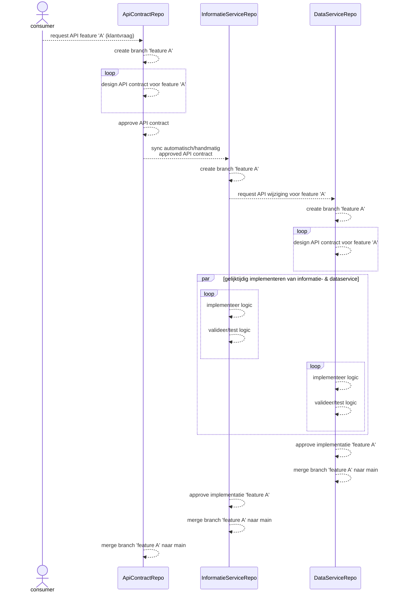

# ADR 0002: Schema-First API Design

## Status
Voorstel

## Context
Om op een consistente en duidelijke manier een goed onderhoudbare contract voor de BRP API te kunnen ontwerpen en te kunnen documenteren, is er behoefte aan een werkwijze die dit faciliteert.

## Beslissing
We hebben besloten om het contract voor de BRP API te documenteren met behulp van de [OpenAPI Specificatie][OAS] en de [Schema-First API Design][SchemaFirst] aanpak te hanteren voor de BRP API ontwikkeling.
Dit betekent dat voor elk te implementeren wijziging/toevoeging eerst wordt gekeken of de implementatie wijziging/toevoeging zal leiden tot een wijziging van het API contract. De wijziging aan het API contract wordt dan vóór de implementatie wijziging/toevoeging uitgevoerd.

## Consequenties
- **Voordelen:**
    - Duidelijke en consistente API contract.
    - Verbeterde communicatie tussen de stakeholders.
    - Eerder en gemakkelijker valideren van het API contract.
    - Betere Developer Experience (betere documentatie, client code generatie en consumers en provider van het API contract kunnen parallel worden geïmplementeerd).

- **Nadelen:**
    - Mogelijke leercurve voor provider developers die niet bekend zijn met Schema-First API design.
    - De code gegenereerd aan de hand van een in OAS gespecificeerde API contract is niet altijd correct, waardoor de gegenereerde code moet worden aangepast.

## Overwogen alternatieven
- **Code-First API Design:** Eerst de wijziging implementeren en vervolgens het API contract genereren vanuit de code. Deze aanpak is niet gekozen omdat de kans groot is dat deze aanpak zal leiden tot onduidelijke en inconsistente API contracten en verkeerde aannames tijdens de implementatie.

## Afspraken

- Een externe API contract (wordt geconsumeerd door applicaties van zowel binnen als buiten de organisatie van de provider) wordt beheerd in een voor dat API opgezette GitHub repo. Dit is een publieke repo zodat de in OAS gespecificeerde API contract voor iedereen benaderbaar is. Een voorbeeld van zo'n repo is de [Haal Centraal BRP bevragen][ApiContractRepo] repo.}

  De benodigde OAS bestanden van/voor het API contract en het gepubliceerde (in de genereervariant map) OAS bestand van het API contract staan in de **specificatie** map van de repo.

  Ten behoeve van consistentie wordt zoveel mogelijk de definitie van bestaande schema componenten (te vinden **specificatie** map in de [brp-shared][BrpShared] repo) hergebruikt om een API contract te specificeren. 

  De repo waar de provider implementatie van het externe API contract wordt beheerd, bevat in zijn **specificatie** map van de **main** branch een kopie van dé versie van het OAS bestand van het externe API contract dat door de provider is geïmplementeerd. Een voorbeeld van zo'n repo is de [personen-informatie-service][InformatieServiceRepo] repo.
- Een interne API contract (kan alleen door applicaties binnen de organisatie van de provider worden geconsumeerd) wordt beheerd in de GitHub repo waar de provider implementatie van het API contract wordt beheerd. Voorbeelden van zo'n repo zijn de [personen-data-service][DataServiceRepo] repo en de [brp-api-gezag][GezagService] repo. De benodigde OAS bestanden van/voor een interne API contract staan ook in de **specificatie** map van de repo.
- Wijzigingen aan een externe API contract worden gedaan in een branch in de repo van het externe API contract. Wanneer de wijzigingen aan het API contract zijn goedgekeurd, dan wordt de nieuwe gepubliceerde versie van het OAS bestand handmatig/automatisch gekopieerd naar de repo van de provider van het API contract. Om de relatie tussen de wijzigingen in de verschillende GitHub repos te kunnen leggen wordt over al de repos dezelfde branch naam gebruikt

Onderstaand sequence diagram illustreert de hierboven beschreven afspraken

[OAS]: https://spec.openapis.org/oas/latest.html
[SchemaFirst]: https://dzone.com/articles/schema-first-api-design
[ApiContractRepo]: https://github.com/BRP-API/Haal-Centraal-BRP-bevragen
[BrpSharedRepo]: https://github.com/BRP-API/brp-shared
[InformatieServiceRepo]: https://github.com/BRP-API/personen-informatie-service
[DataServiceRepo]: https://github.com/BRP-API/personen-data-service
[GezagService]: https://github.com/BRP-API/brp-api-gezag
